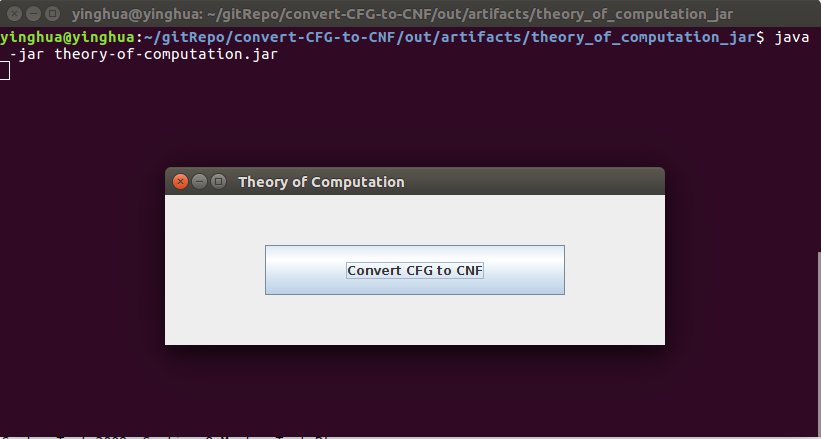
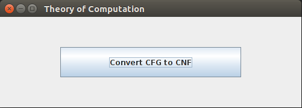
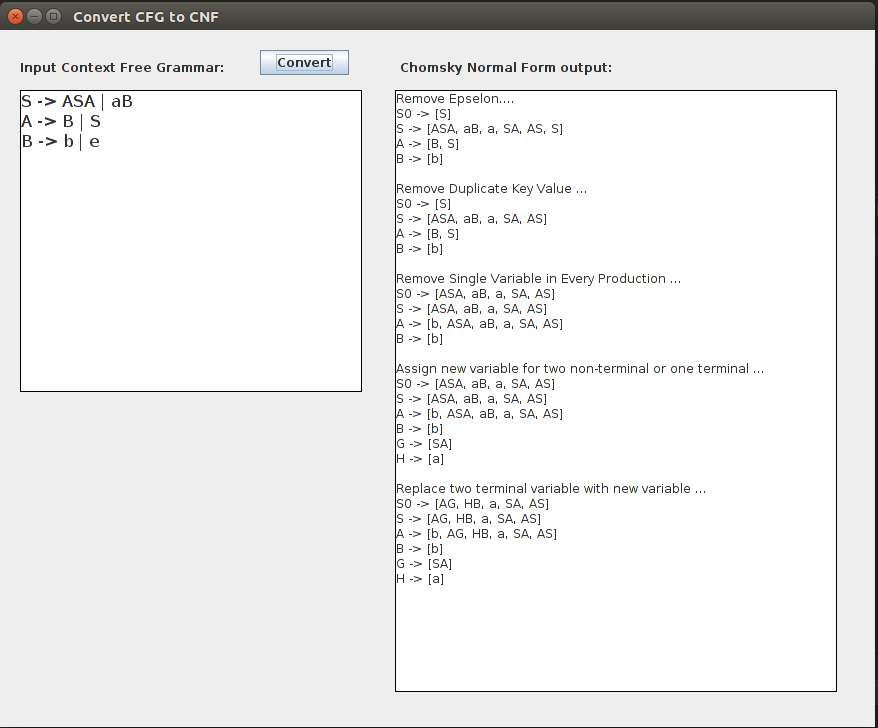

Convert CFG to CNF
==================
> Simple Java application that **convert Context Free Grammar to Chomsky Normal Form** with the knowledge of **Theory Of Computation**.

***

Table Of Contents
=================

* [Convert CFG to CNF](#convert-cfg-to-cnf)
* [Table Of Contents](#table-of-contents)
* [Introduction](#introduction) 
* [Getting Started](#getting-started)
  * [Infrastructure Setup and Installation](#infrastructure-setup-and-installation)
* [Highlights](#highlights)
  * [Software Resources](#software-resources)
  * [Usage](#usage)
* [About](#about)
  * [Contributor](#contributor)
  * [Status](#status)
  

*** 

Introduction
============

**Context-Free Grammars (CFG)**, is a powerful method of describing context free languages that possess recursive structure, which makes them useful in a variety of applications. A language is context free if and only if pushdown automaton (PDA) recognizes it. Many useful languages are context-free, **including most programming languages, query languages, and markup languages**.  

However, CFG can be ambiguous or sometimes unambigious generates from the same language. A grammar is called **inherently ambiguous** if there is no equivalent umambiguous grammar to generates it. When working with context-free grammars CFG, it is often convenient to have them in simplified form. One of the simplest and most useful forms is called the **Chomsky normal form**.  

This application attempt to receive CFG as input and transformed into CNF grammar expressing as same language, all the **procedure and steps** are shown in the program. 

***

Getting Started
===============
Infrastructure Setup and Installation
-------------------------------------
1. Clone the sourcecode with Git: 
```sh
$ git clone https://github.com/CodesAreHonest/convert-CFG-to-CNF.git
```  
2. Go to the cloned repository and change directory to the containing JAR files under out/artifacts/theory_of_computation_jar/.
```sh
$ cd out/artifacts/theory_of_computation_jar
``` 
3. Run the JAR file. 
```sh
$ java -jar theory-of-computation.jar
```
<p align="center"></p>  

***

Highlights
==========
Software Resources
------------------
1. Linux Ubuntu 16.04.03 LTS 64-bit 
2. IntelliJ IDEA Ultimate 
3. Java 1.8.0_151 SE Runtime Environment 

Usage 
-----
1. Run the application according to the steps mentioned above, pressed the button to proceed.  
<p align="center"></p>   

2. Insert the Context-Free Grammar at the textbox, the arrow must be **->** and cannot be other symbols. 
3. Press the **Convert** button and the output will be display.  
<p align="center"></p>   

**Remark:** The application is not fault tolerance, if the input is wrong error message will be displayed and it requires user to relaunch the application again.  

*** 

About
=====
Contributor
-----------
- **Chai Ying Hua**


Status
------
This project had stop maintaining and delivered as coursework to Multimedia University. Any improvement or pull request is welcomed. 


